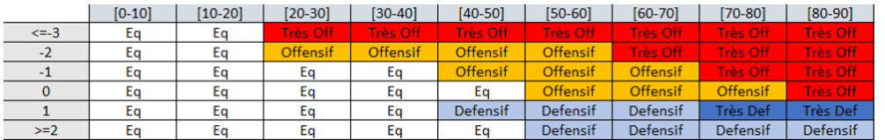
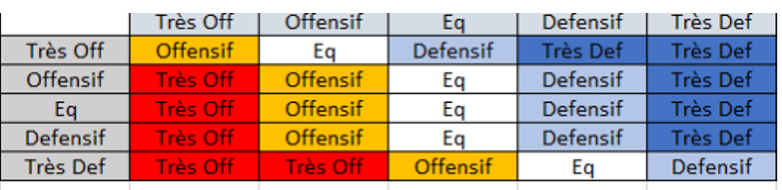
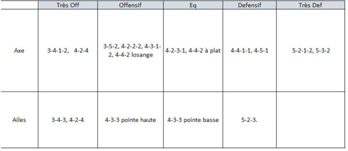
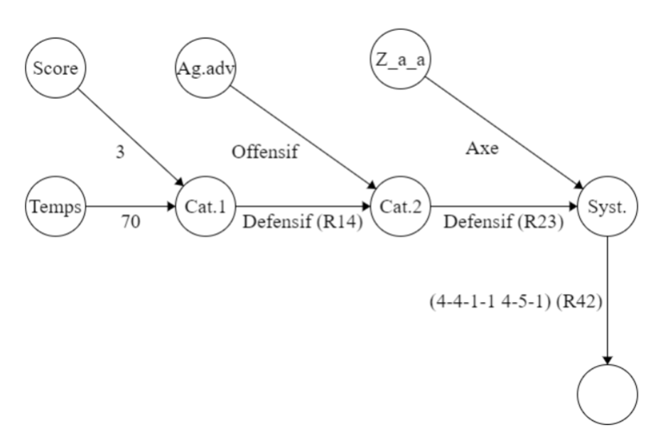

# Système expert : Aide au choix d’un système tactique lors d’un match de football

Système expert pour évaluer quelle stratégie adopter lors d'une rencontre de football. Il s'agit d'un des 3 projets à réaliser dans le cadre du cours IA01 (Intelligence Artificielle : Représentation) dispensé à l'Université Technologique de Compiègne (UTC) par Mme. Marie-Hélène Abel.

Réalisé par Maxence Martin et Hugo Milair.

## Description

Le but de ce projet est de réaliser un **système expert d'ordre 0+** prennant en compte 3 paramètres. Notre choix s'est porté sur l'aide à la décision pour un entraîneur de football. En effet, lors d'un match, il est important de choisir la bonne tactique pour gagner. 

Un **système tactique** est une manière de disposer les 10 joueurs de champs de son équipe sur un terrain. Formellement, une système se représente sous la forme *X-Y-Z* où *X* est le nombre de défenseurs, *Y* le nombre de milieux de terrain et *Z* le nombre d'attaquants. Par exemple, un système 4-4-2 signifie qu'il y a 4 défenseurs, 4 milieux de terrain et 2 attaquants. On peut observer certaines variantes comme le 4-2-3-1, qui signifie qu'il y a 4 défenseurs, 2 milieux de terrain défensifs, 3 milieux de terrain offensifs et 1 attaquant.

Les paramètres pris en compte par notre système expert sont les suivants :

- **le temps écoulé dans le match** . Une tactique doit être adaptée au temps restant, et il s'agit de ne pas jeter toutes ses forces dans la bataille dès le début du match.
- **le score du match**. Si l'équipe est menée, il est préférable de tenter marquer des buts, tandis que si l'équipe mène, il conviendait d'adopter une posture plus défensive afin de conserver le score.
- **le type de système tactique de l'équipe adverse**. Il est crucial de s'adapter à la tactique de l'équipe adverse pour maximiser ses chances de victoire. On a découpé les systèmes tactiques en 5 catégories : très défensif, défensif, équilibré, offensif et très offensif.
- **la zone à attaquer**. L'entraîneur, en fonction des forces de son équipe, peut choisir de privilégier une zone du terrain pour attaquer, soit l'axe, soit les ailes.

## Fonctionnement

Le code défini une cinquantaine de règles qui permettent de trancher sur une tactique à adopter. La liste des systèmes pris en compte est donnée ci-dessous :

- 3-4-1-2
- 3-4-3
- 3-5-2
- 4-2-2-2
- 4-2-3-1
- 4-2-4
- 4-3-1-2
- 4-3-3
- 4-4-1-1
- 4-4-2 à plat
- 4-4-2 losange
- 4-5-1
- 5-2-3
- 5-3-2
- 5-4-1

Le programme invite l'utilisateur à entrer les valeurs des paramètres dans l'ordre suivant.

1. Le temps écoulé dans le match (en minutes)
2. La différence de buts entre les deux équipes. Le système infère alors, en prenant en compte le temps restant, sur le type de système tactique à choisir. Ce choix sera affiné par la suite.

3. Le type de système tactique de l'équipe adverse. Alors, le S-E affine et peut revenir sur son son choix précédent. Les colonnes de la figure ci-dessous représentent le type de système de l'adversaire, tandis que les lignes représentent le type de système choisi à l'étape précédente.

4. La zone à attaquer. Le système expert renvoie alors un ou plusieurs systèmes tactiques que l'entraîneur pourrait choisir afin de maximiser ses chances de victoire.


## Exemple

Le diagramme d'état ci-dessous montre un exemple d'utilisation du système expert. 70 minutes se sont écoulées dans le match, l'équipe gagne par 3 buts d'écarts, l'adversaire joue dans un système offensif et on souhaite attaquer par l'axe. Le système expert propose alors les systèmes 4-4-1-1 et 4-5-1.


## Lancer le programme

Pour lancer le programme contenu dans le fichier expert-system.cl, il faut avoir installé un interpréteur COmmon Lisp comme **CLISP**. Par exemple, sous Linux:

```bash
sudo apt-get install clisp
clisp expert-system.cl
```

## Remarques

S'il est fonctionnel, ce système expert présente tout de même des limites liées aux spécificités du sport en lui-même:

- il est possible d'adopter plusieurs systèmes tactiques à la fois, notamment un pour les phases offensives et un autre pour les phases défensives. Notre système expert ne prend pas en compte cette possibilité et impose un unique système.
- notre système expert est conçu en partant du principe que l'équipe souhaite absolument gagner le match, peut importe le résultat. Or, selon le contexte d'un match, un nul pourrait suffire, ou une large victoire pourrait être nécessaire pour remonter un déficit de buts dans un classement ou une compétition.
- le système ne prend pas en compte la forme physique des joueurs, ni la physionomie réelle du match. Par exemple, si un joueur est blessé, ou si l'équipe adverse est en infériorité numérique, il serait peut-être plus judicieux de changer de système tactique.